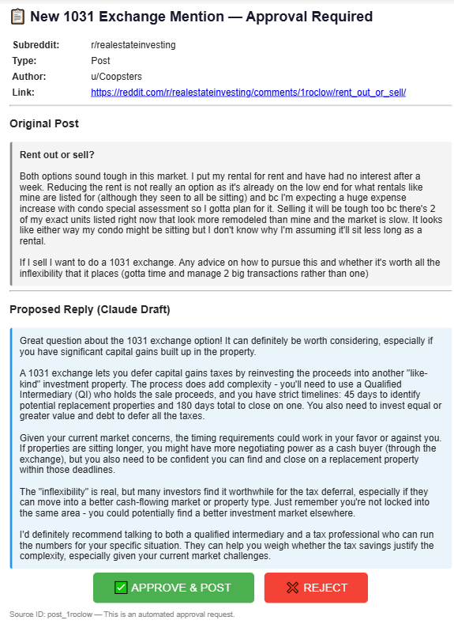
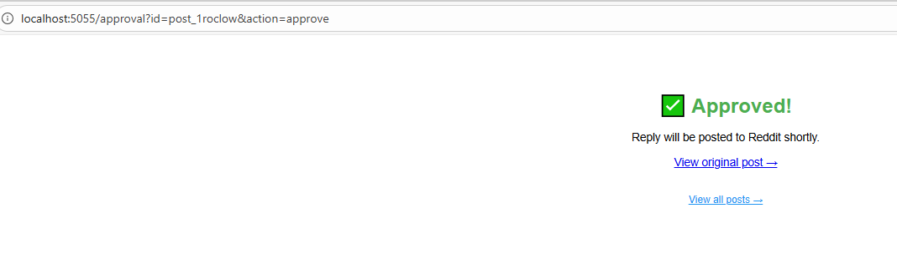
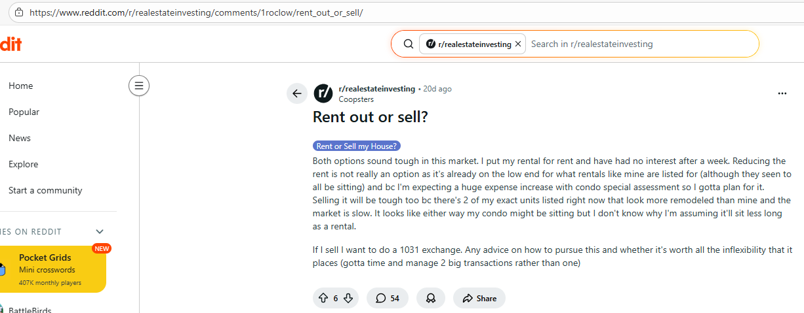
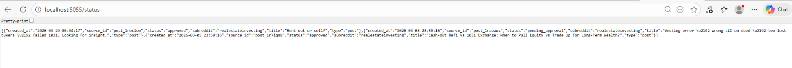

# 1031 Exchange Forum Monitor — POC

Automated system that monitors Reddit for mentions of "1031 exchange",
generates responses with Claude, requests approval via email, and posts automatically.

## 🎬 Demo

### 1. Approval Email
When a relevant post is found, you receive an email with the original post and Claude's draft response:



### 2. One-Click Approval
Click "Approve & Post" and the system confirms:



### 3. Original Reddit Post
The post that triggered the detection:



### 4. Status Dashboard
Track all processed posts at `localhost:5055/status`:



---

## Complete Flow

```
Reddit → scraper.py → responder.py (Claude) → emailer.py → [APPROVE/REJECT]
                                                                    ↓
                                                           approval_server.py
                                                                    ↓
                                                             poster.py → Reddit
```

## Quick Setup

### 1. Create virtual environment and install dependencies
```bash
python -m venv venv
venv\Scripts\activate        # Windows
pip install -r requirements.txt
```

### 2. Configure credentials
```bash
copy .env.example .env
# Edit .env with your credentials
```

Required credentials:
| Service | Where to get it |
|---------|-----------------|
| Claude API | https://console.anthropic.com/ |
| Gmail App Password | https://myaccount.google.com/apppasswords |

> **Note:** This POC uses Reddit's public JSON endpoints (no API key required for reading).

### 3. Run
```bash
python main.py
```

The system starts two processes in parallel:
- **Monitor loop** — scans Reddit every 5 minutes
- **Approval server** — listens on http://localhost:5055

### Dashboard
Open http://localhost:5055/status to view all processed posts.

## Files

| File | Purpose |
|------|---------|
| `config.py` | Centralizes all configuration |
| `database.py` | SQLite: post tracking and state |
| `scraper.py` | Fetches Reddit posts via public JSON (no API key) |
| `responder.py` | Claude API — generates draft responses |
| `emailer.py` | Gmail SMTP — sends approval email with buttons |
| `approval_server.py` | Flask — receives Approve/Reject clicks |
| `poster.py` | Handles approved replies (manual post mode) |
| `main.py` | Orchestrates everything in a continuous loop |

## Post States

```
pending → draft_ready → pending_approval → approved → posted
                                         ↘ rejected
                      (error at any point) → error
```
